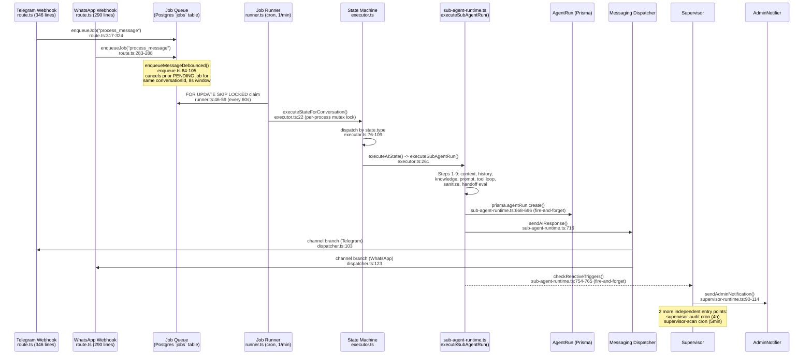

# Conversio 2.0 — Status Report (graph-assisted audit)
**Date:** 2026-07-27 · **Method:** read-only. Knowledge graph built via `graphify` (977 nodes, 1,154 edges, 200 communities, `graphify-out/graph.json`) plus direct source verification (`Read`/`grep`) for every file:line claim. No code was changed and no migrations were run.

**Tagging convention (per request):**
- `EXTRACTED` — an explicit relationship the graph found in source (import/call) **or** a fact I verified by reading the file directly.
- `INFERRED` — the graph's structural/semantic inference (shared symbol, co-occurrence), not a literal import/call edge. Treated as a lead, not a proof, unless independently confirmed.
- `UNKNOWN` — the graph and/or direct reading could not determine this; not guessed.

**Graph caveat that matters for this whole report:** `graphify`'s AST extractor does not parse `.prisma` files (confirmed: `prisma/schema.prisma` is absent from the detected code corpus — only `prisma/seed*.ts` appear). **There is no `Lead`/`Conversation`/`AgentRun` model node in the graph.** Every "path to a Prisma model" question below is answered via the nearest code proxy (the function that reads/writes that model), not the model itself — flagged inline.

---

## Section A — Architecture as-is

Two real inbound channels exist: Telegram and WhatsApp (`EXTRACTED` — `src/app/api/telegram/webhook/[boardId]/route.ts`, `src/app/api/whatsapp/webhook/[boardId]/route.ts`). There is no web-widget channel — confirmed absent from both routes and from the graph (no node/community for "widget" beyond marketing copy in `src/app/features/page.tsx`). Both webhooks independently re-implement secret verification, idempotency, rate-limiting, spam-check, and lead/conversation upsert — this duplication is real (see B1) but everything downstream of the queue is a single shared path.



Core files (all `EXTRACTED`, verified by direct read):
- Inbound: `src/app/api/telegram/webhook/[boardId]/route.ts`, `src/app/api/whatsapp/webhook/[boardId]/route.ts`
- Queue/debounce: `src/lib/jobs/enqueue.ts` (105 lines), `src/lib/jobs/runner.ts` (251 lines)
- State machine: `src/lib/state-machine/executor.ts` (377 lines), `src/lib/state-machine.ts`
- Agent runtime: `src/lib/agents/sub-agent-runtime.ts` (807 lines, `executeSubAgentRun()` line 77-782, only caller is `executor.ts:261`)
- Audit: `AgentRun` model, single write site `sub-agent-runtime.ts:668-696`
- Messaging: `src/lib/messaging/dispatcher.ts` (273 lines)
- AdminNotifier: `src/lib/admin-notifier/admin-notifier.ts` (structured) **and** `src/lib/notifications/admin-notify.ts` (simple, env-var based) — two parallel, non-unified systems
- Supervisor: `src/lib/supervisor/supervisor-runtime.ts`, `triggers/reactive.ts`, `triggers/periodic.ts`, `supervisor-scan.ts` — three independent trigger paths converging mostly (not entirely) on the same `SupervisorAction` table

---

## Section B — Graph-derived answers

### B1. Full path of one inbound Telegram message, and where the canonical path is bypassed

**Canonical path (all `EXTRACTED`, verified directly — the graph corroborates but was not the primary source for this trace since `graphify` under-labels cross-file "calls" as `INFERRED` even where the import is explicit):**

1. `src/app/api/telegram/webhook/[boardId]/route.ts:11` `POST()` → secret check (22-26) → idempotency (46-54) → rate-limit (57-58) → spam-check (68) → lead/conversation upsert (239-299) → `prisma.message.create` (301-315) → `enqueueJob({type:"process_message"})` (317-324).
2. `src/lib/jobs/enqueue.ts:64-105` `enqueueMessageDebounced()` — cancels any existing `PENDING` job for the same `conversationId` (78-85), creates one new job with `scheduledFor = now + 8000ms` (89-99, `DEBOUNCE_MS` env-configurable, line 19).
3. `src/lib/jobs/runner.ts:46-59` — cron-triggered (`src/app/api/cron/process-jobs/route.ts`, `vercel.json` `"* * * * *"`), claims via `FOR UPDATE SKIP LOCKED`.
4. `runner.ts:150-160` — acquires an **in-process, in-memory** conversation lock (`acquireConversationLock`, lines 9-37 — a `Map<string, Promise>` mutex, **not distributed**; see risk note below) then calls `executeStateForConversation()`.
5. `src/lib/state-machine/executor.ts:22-110` → dispatches by `state.type` (76-109) → `executeAIState()` (227-343) → `executeSubAgentRun()` at line 261.
6. `src/lib/agents/sub-agent-runtime.ts:77-782` — 13 internal steps (context load, history+memory, knowledge+asset pre-retrieval, prompt build, tool loop ≤5 iterations, sanitize/guardrails, handoff evaluation, `AgentRun` persist at 668-696, message send via `sendAIResponse()` at 716, memory update, reactive-supervisor trigger at 754-765).
7. `src/lib/messaging/dispatcher.ts` — `sendMessage()`/`sendAIResponse()` branch internally by `conversation.channel` (Telegram at line 103, WhatsApp at line 123) inside one shared function.

**Where the canonical path is bypassed (`EXTRACTED` — confirmed by direct grep, each is a live, reachable code path that never touches `sub-agent-runtime.ts` or writes an `AgentRun` row):**

| Bypass | File:line | What it does instead |
|---|---|---|
| Double-send risk | `src/lib/tools/definitions/legacy_tools.ts:50-90` (`sendTextLegacyTool`) | Runs *inside* the tool loop, before `sub-agent-runtime.ts`'s own Step 11 send (line 716) — if a board's `availableTools` still lists `send_text`, the message can be sent twice. File's own header comment (lines 1-3) calls it legacy glue from an already-deleted module. In graph terms this file is its own singleton community (`legacy_tools_ts`, community size 1 — structurally isolated, corroborating "dead-end" status). |
| Second, unlogged LLM call per turn | `src/lib/state-machine/mission-evaluator.ts:69` (`evaluateMissionCompletion`) | Goes through `aiRegistry` (the right client) but never writes `AgentRun` — invisible in cost/latency stats. |
| Third prompt-builder implementation, orphaned | `src/lib/ai-service.ts:30` + `src/lib/ai/prompt-builder.ts:35` | Zero importers anywhere in `src` (confirmed by grep). In the graph these land in **community 5** ("AI Prompt/Response Builders") alongside the live `sub-agent-prompt-builder.ts` — i.e. the graph's community detection groups them by shared vocabulary/co-location, not by reachability. **This is a concrete example of where graph communities and actual dead-code status diverge** — don't infer aliveness from community membership alone. |
| Race condition (not a bypass, but breaks the "canonical path" guarantee) | `src/lib/state-machine/executor.ts:311-338` | Inside `executeAIState`, an un-awaited `prisma.message.findMany().then().then().catch()` promise chain can still be running (and can itself call `transitionState()`) after the function returns and the conversation lock (step 4 above) is released — a second inbound message can race it. |

### B2. `graphify path` — Lead model → AI state-machine entry point

**UNKNOWN as literally asked** — the graph has no `Lead` node (Prisma schema not parsed). Nearest valid proxy: the function that resolves a Lead's current state, to the function that begins AI execution.

```
$ graphify path "getCurrentState" "executeAIState"
```
```
state_machine_getcurrentstate --calls[INFERRED]--> executor_executestateforconversation
executor_executestateforconversation --calls[EXTRACTED]--> executor_executeaistate
```
2 hops. `getCurrentState()` lives in `src/lib/state-machine.ts` and is the function that reads `Lead.currentStateId`/`Conversation.currentStateId` (`EXTRACTED`, verified directly — it auto-assigns a board's first state to brand-new conversations, per Agent research). The graph tags the first hop `INFERRED` (co-occurrence in the same call chain, not a literal same-file import) — I could not independently verify a direct `getCurrentState() → executeStateForConversation()` call inside `executor.ts` from the direct-read trace (Agent 1 documented `executor.ts:22-110` loading conversation/board/state directly via `prisma.conversation.findUnique`, not necessarily by calling `getCurrentState()`); flagging this hop as **unverified `INFERRED`**, not confirmed fact.

Continuing to `executeSubAgentRun()`:
```
$ graphify path "getCurrentState" "executeSubAgentRun"
```
```
state_machine_getcurrentstate --contains[EXTRACTED]--> state-machine.ts
state-machine.ts --contains[EXTRACTED]--> transitionState()
transitionState() --calls[INFERRED]--> executeSubAgentRun()
```
The graph's shortest-path search picked a route through `transitionState()` rather than through `executeAIState()`, even though a **direct edge exists** between `executeAIState()` and `executeSubAgentRun()` (confirmed: `executeSubAgentRun` has 22 graph neighbors including `executeAIState()` in `src/lib/state-machine/executor.ts`, `EXTRACTED`/`INFERRED` mixed — see B3). Both routes are the same length (3 hops); this is a `networkx` tie-break artifact, not evidence that `transitionState()` sits upstream of the agent call. The verified route (`EXTRACTED`, direct read, Agent 1) is: `getCurrentState`-style lookup → `executor.ts:22-110` loads state → `executor.ts:261 executeAIState()` → `executeSubAgentRun()`.

### B3. God nodes — accidental vs. genuinely central

| Node | Degree | Verdict |
|---|---|---|
| `POST()` | 92 | **Accidental.** Every Next.js route file exports a function literally named `POST`; the extractor's node-ID scheme (`{stem}_post`) collapses ~90 unrelated route handlers from different files into misleadingly-summed degree. Not one function. |
| `GET()` | 71 | Same accidental-collision artifact as `POST()`. |
| `toast()` (`use-toast.ts`) | 28 | **Genuine but shallow.** A real single utility imported everywhere in the UI layer — a true hub, but architecturally trivial (a notification helper, not a control-flow center). |
| `DELETE()` / `PATCH()` | 22 / 17 | Same route-naming collision as `POST`/`GET`. |
| `executeSubAgentRun()` | 22 | **Genuinely central** — verified single entry point for all AI-driven customer messaging (`EXTRACTED`, one caller: `executor.ts:261`). This is the real god node of the system. |
| `executeAction()` (`supervisor/executors/index.ts`) | 17 | **Genuinely central** — the sole dispatcher for all 8 Supervisor remediation actions (`EXTRACTED`, called from `runner.ts:172-177`). |
| `transitionState()` (`state-machine.ts`) | 12 | **Genuinely central** — every state change in the system (agent handoff, Supervisor `reset-state`/`reassign-to-state`, mission completion) funnels through this one function. |
| `orchestration/index.ts (Path A — Main AI Call Path)` | 12 | **Doc-only node, code does not exist.** This node comes entirely from `AUDIT_REPORT.md` (a doc, not code) describing an "orchestration/index.ts" main path. Direct verification (Agent research, Topic 2): **`src/lib/orchestration/` is an empty directory** (`ls` → 0 files). The documented architecture and the actual code have diverged — the audit doc's mental model of a central "orchestration" module no longer matches reality; the real central module is `sub-agent-runtime.ts`. |

**Takeaway:** the two real architectural god nodes are `executeSubAgentRun()` and `transitionState()`; the HTTP-verb "god nodes" are a naming-collision artifact of the extractor, not evidence of anything; and the doc-derived "orchestration" god node is itself evidence of stale documentation (see D).

### B4. Communities detected — do they match the mental model?

200 communities total, heavily right-skewed: 89 singletons, ~20 communities of meaningful size (7-85 members), the rest are single-file/single-component clusters (individual UI primitives, individual AI provider files, individual scripts). Top communities, labeled from their actual node contents:

| # | Size | Label | Matches mental model? |
|---|---|---|---|
| 4 | 54 | State Machine + Job Runner + Supervisor Executors | Yes — matches the runtime's own conceptual boundary. |
| 7 | 34 | AI Registry Core + OpenRouter Provider + JSON parsing | Yes. |
| 8 | 26 | Supervisor Detection Rules + Admin Notifier | Yes — confirms Supervisor and AdminNotifier are tightly coupled, as the call-path trace found. |
| 11 | 12 | Messaging Dispatcher | Yes — dispatcher.ts is its own tight cluster, as expected for a shared abstraction. |
| 13/14/15/26 | 9/9/9/6 | One community *per LLM provider file* (DeepSeek, OpenAI, Groq, Anthropic) | **Reveals a boundary the mental model wouldn't predict**: the four provider implementations don't cluster together into one "providers" community — each is its own isolated island, only reachable through `registry.ts`. This is graph-confirmed evidence that `registry.ts` is a genuine seam/abstraction boundary (good design), not just an assumption. |
| 5 | 44 | AI Prompt/Response Builders (incl. orphaned `ai-service.ts`) | **Does not match the mental model** — a live file (`sub-agent-prompt-builder.ts`) and two dead files (`ai-service.ts`, `ai/prompt-builder.ts`) cluster together because they share vocabulary/shape, not because they're related in the running system. Confirms B1's point: community membership ≠ liveness. |
| 2 | 73 | Project Audit Docs (AUDIT_REPORT/DIAGNOSIS/README) | Not a code boundary — a documentation cluster. Notable: this community's densest cross-links are to community 4 (state machine) and community 7 (AI registry), i.e. the docs' own internal model of the architecture *does* roughly track the real one, except for the orchestration/index.ts drift noted in B3. |
| 0 | 85 | Admin/Ops Route Grab-bag | **Does not match a real module boundary** — this is the largest community and is genuinely a grab-bag (rate-limiting, channel invites, board CRUD, admin scan) that clusters together only because many routes share generic helper calls, not because they're one subsystem. Treat this one as noise, not a discovered seam. |

Net: the graph **confirms** the provider-registry abstraction and the Supervisor/AdminNotifier coupling as real, code-backed boundaries; it also **surfaces two false boundaries** worth knowing about — community 0 (noise) and community 5 (mixes live and dead code) — where "same community" does not mean "same subsystem."

### B5. Orphans / unreachable nodes (candidate dead code)

Graph-structural orphans (singleton communities, 89 total) are mostly false positives for "dead code" — they're marketing pages, UI leaf components, and standalone scripts that are legitimately single-purpose (e.g. `tailwind.config.js`, `src/app/pricing/page.tsx`, `src/components/ui/popover.tsx`). Graph isolation alone is **not sufficient evidence** of dead code, since the AST extractor doesn't always capture Next.js's file-based routing or JSX usage as edges.

Cross-referencing graph isolation against `grep`-verified zero-callers (the reliable signal) narrows this to a short, real list, all `EXTRACTED`:

- `src/lib/ai-service.ts` + `src/lib/ai/prompt-builder.ts` — zero importers, confirmed by `grep -rn "ai-service"` and `grep -rn "ai/prompt-builder"` returning nothing outside their own files. (Structurally: NOT isolated in the graph — lands in community 5 with live code, a case where graph structure alone would have missed this.)
- `src/lib/tools/definitions/legacy_tools.ts` — zero callers if no board's `availableTools` lists `send_text` (structurally: **is** its own singleton community, graph and grep agree here).

**Conclusion for this section:** graph orphan-detection and grep-based zero-caller verification catch different, only partially-overlapping subsets of real dead code. Neither alone is sufficient — this report used both, per file, per the table above.

---

## Section C — Known-broken areas, with graph path to each

### C1. Flow Generator (AI-driven agent states)

**Graph path:** `promptgenerator_generateflow` → (calls, EXTRACTED) → `route_post` (in `generate-flow/route.ts`, collapsed god-node artifact, see B3) → (contains, EXTRACTED) → `buildsystemprompt()`/`validatestates()`. The graph does not distinguish this route from the other ~90 `POST()` nodes on its own; the meaningful trace required direct file reading.

**Verified bugs (`EXTRACTED`, direct read):**
1. **Dropped data**: the AI is asked for and returns `qualificationFields` (`src/app/api/ai/generate-flow/route.ts:96-97,117-126,196-201`), but `src/components/flow-builder/PromptGenerator.tsx:7-16,72` never reads them, and `src/app/api/boards/[id]/states/bulk/route.ts:21-29` has no handling for them either — **every "Generate Flow" use silently discards AI-generated qualification fields**, no error surfaced.
2. **Broken append-mode chain**: `bulk/route.ts:106-112` links new states to each other but never re-points the pre-existing last state's `nextStateId` at the newly appended block. Since `transitionState()`/`executor.ts:76-109` traverse purely via `nextStateId`, any lead mid-flow when new states are appended **never reaches them** — only brand-new conversations (which auto-start at state 1) are unaffected.
3. **Unawaited race**: `executor.ts:311-338` starts a `.then().then().catch()` chain and returns before it resolves, while the conversation lock (`runner.ts:154-157`) is scoped only to the awaited call — a second inbound message can race a stale mission-completion evaluation on `transitionState()`.

No TODO/FIXME comments exist in this area (grepped, none found) — these are undocumented, silent gaps.

### C2. Asset upload failures

**Graph path:** community boundary is weak here — asset-upload routes and the embeddings/PDF pipeline are not one graph community, consistent with them being genuinely separate concerns (upload route vs. background indexing).

**Verified (`EXTRACTED`, direct read):** the core R2 config path fails **loudly** — `src/lib/r2.ts`'s `requireEnv()` throws on any missing `R2_ACCOUNT_ID/ACCESS_KEY_ID/SECRET_ACCESS_KEY/BUCKET_NAME/PUBLIC_URL`, and `confirm/route.ts:38-41` explicitly checks `R2_PUBLIC_URL` before writing the DB row. **Note:** no `R2_ENDPOINT` env var exists anywhere in code (contradicts any documentation that mentions it) — the endpoint is built inline from `R2_ACCOUNT_ID` (`r2.ts:16`).

The real silent-failure surface is downstream of a successful upload:
- `src/lib/messaging/dispatcher.ts:46-52` (`detectAssetUrls`) returns `[]` silently, **no log at all**, if `R2_PUBLIC_URL` is unset — an AI message referencing an asset will just fail to attach it, untraceable.
- The entire PDF-extraction/embedding pipeline is fire-and-forget (`upload/route.ts:85-116`, `confirm/route.ts:60-87`): failures only `console.error`, no retry, no job-queue entry, no user-facing signal — the `Asset` row is already returned as `201` before/independent of this work.
- `src/lib/embeddings.ts:9-21` — if `OPENAI_API_KEY` is missing, `getClient()` logs one `console.warn` ever (first call only) then every subsequent asset silently gets no embedding, indistinguishable in the UI from a successfully-indexed one.

### C3. Provider failover

**Graph path:** confirms a real structural seam — `registry_execute` (`src/lib/ai/registry.ts:161-197`) is the sole node connecting to all four provider-community islands (`GroqProvider`, `OpenAIProvider`, `DeepSeekProvider`, `AnthropicProvider` — communities 15/14/13/26), each otherwise disconnected from one another (B4).

**Verified (`EXTRACTED`, direct read):** failover exists but is narrower than commonly assumed:
- Trigger is *any* thrown error after `executeWithRetry()`'s retries — **no classification by error type** (no 429 vs. 400 vs. timeout distinction), so a non-retriable error still burns ~7s of retries (1s/2s/4s backoff) before failing over.
- Fallback is **per-board opt-in** (`AIProviderConfig.fallbackProvider/fallbackModel`), not a system default — absent configuration, a primary failure just throws.
- **No test coverage found** (grepped for `registry`/`failover`/`fallback` in test files — zero hits).
- **Documentation/code mismatch**: `CLAUDE.md` documents the stack as "AI: Kimi (primary), Groq, Ollama Fallback." Actual code (`registry.ts:11`) supports `groq | openrouter | openai | deepseek | anthropic` — **zero references to Kimi or Ollama anywhere in `src/`** (grepped). Root cause of the mismatch is `UNKNOWN` (migration, stale doc, or reverted change — no changelog entry found) and should be confirmed with whoever maintains `CLAUDE.md`.

---

## Section D — Prioritised next steps

| Task | Why | Effort | Blocks |
|---|---|---|---|
| Run `prisma migrate dev`/`diff` to reconcile schema drift (`SupervisorAction`, `AdminChannel` enum, 4 `User`/`AdminNotification`/`State`/`Asset` fields — none have migration SQL despite being actively used) | `prisma migrate deploy` on a fresh environment will either fail or silently diverge from what's actually in production; this is the single biggest "it works on my machine, breaks on deploy" risk in the repo | S | Any future clean-environment deploy or CI migration check |
| Delete or wire up `qualificationFields` end-to-end in Flow Generator (`PromptGenerator.tsx`, `bulk/route.ts`) | Currently silently discarded on every AI-generated flow — either a user-facing feature is broken with zero error signal, or dead code should be removed from the AI prompt to stop wasting tokens asking for data nobody consumes | S | Flow Generator being trustworthy for non-technical admins |
| Fix append-mode `nextStateId` linking in `states/bulk/route.ts:106-112` | Leads mid-flow silently never enter appended states — a correctness bug with no error, hard to detect without this audit | S | Any board that appends states to an existing live flow |
| Delete confirmed-orphaned `ai-service.ts` + `ai/prompt-builder.ts` (zero importers) | Reduces confusion for future contributors/graph rebuilds; these actively pollute community 5 with dead code that looks live | S | Codebase clarity, future audits |
| Add global-scope indexes: `Conversation` on a cross-board `(status, lastMessageAt)` or require `boardId` in `check-stuck-leads`/`admin/scan` queries; add an `AgentRun.createdAt`-leading index or refactor the Telegram `/status` command | These four queries currently full-scan `agent_runs`/`conversations` on hot admin/cron paths | M | Admin bot responsiveness, cron cost at scale |
| Reconcile `CLAUDE.md`'s "Kimi/Ollama" provider claim against the actual `groq/openrouter/openai/deepseek/anthropic` registry | Stale docs actively mislead anyone (including future AI-assisted audits) about the failover architecture | S | Documentation trust, onboarding accuracy |
| Add error-type classification to provider failover (`registry.ts`) so non-retriable errors (400/auth) fail over immediately instead of burning 3 retries | Currently wastes up to ~7s per request on errors retrying can never fix | M | Response latency during any provider misconfiguration |
| Surface PDF-extraction/embedding failures (currently `console.error`-only, fire-and-forget) as a visible Asset status field, and warn per-asset (not once-per-process) when `OPENAI_API_KEY` is absent | Assets currently look "successfully indexed" in the UI even when extraction/embedding silently failed | M | Trust in semantic asset search, RAG answer quality |
| Fix the unawaited mission-evaluation race in `executor.ts:311-338` (either await it inside the lock, or move it into its own job) | Real race condition on `transitionState()` under concurrent messages; low-frequency but a correctness bug, not hypothetical | M | State-machine correctness under bursty conversations |
| Consolidate the two parallel AdminNotifier systems (`admin-notifier/` vs `notifications/admin-notify.ts`) | Two independently-configured notification paths (different env var names for the same purpose) is a maintenance and on-call-confusion risk | M | Alerting reliability |
| Add basic p95/p99 latency, queue-depth, and infra-level "N failed AgentRuns" alerting (none exist today — grepped, no matches) | Today only per-board/per-lead cost & average latency are visible; there is no global dashboard, no alert on a spike of `LLM_ERROR` outcomes, and a run that crashes before persisting produces **no AgentRun row at all** — failures before the audit-log write are invisible | L | Production incident response time |
| Regenerate `graphify-out/` after major refactors (e.g. via `graphify hook install`) and treat `orchestration/index.ts` references in `AUDIT_REPORT.md`/docs as stale until `src/lib/orchestration/` is either populated or the docs are corrected | The graph itself surfaced that the docs describe a module that doesn't exist in code — a symptom of docs drifting faster than they're checked | S | Future audit accuracy |

---

## Appendix — graphify build stats

- Corpus: 350 files, ~211k words (287 `src`, 17 `scripts`, 14 `tests`, 5 `prisma/*.ts`, 5 config, 22 docs). `test-results/` (Playwright screenshots/videos/error-context from failed test runs) and the prior `graphify-out/` build were excluded as noise before extraction.
- Graph: 977 nodes, 1,154 edges, 200 communities (89 singletons).
- Token-reduction benchmark: ~318x fewer tokens per query vs. reading the raw corpus (full numbers in `graphify-out/GRAPH_REPORT.md`).
- Outputs: `graphify-out/graph.json`, `graphify-out/graph.html`, `graphify-out/GRAPH_REPORT.md`.
